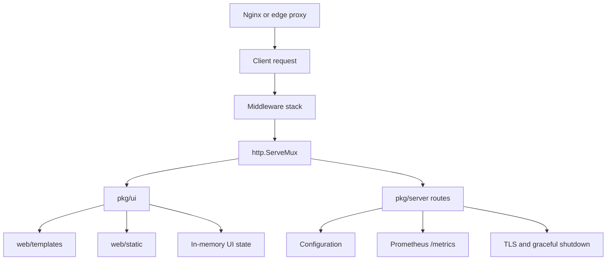
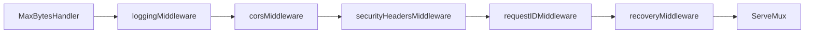
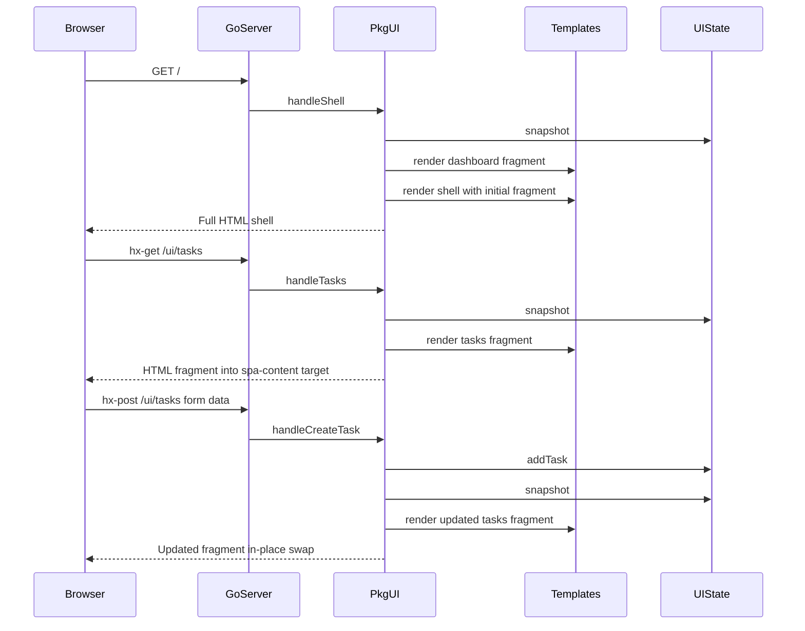

# Secure Go Web Template

Production-oriented Go web template built with standard library primitives, server-rendered HTML templates, HTMX-driven SPA-style interactions, and explicit security middleware.  
Rate limiting is **not** implemented in-process; enforce it at the edge (for example, Nginx).

## What this template provides

- TLS-ready HTTP server lifecycle with graceful shutdown.
- Security middleware (headers, panic recovery, request IDs, body/header limits).
- Explicit CORS policy controls through environment variables.
- Structured JSON logging with request correlation and Prometheus metrics.
- Server-rendered SPA-style UI using Go `html/template` + HTMX (no frontend framework).
- Modular UI package and separated templates/CSS for maintainability.

## Architecture at a glance

The app is intentionally split into two runtime layers:

1. **Core HTTP platform** (`pkg/server`)
   - Configuration loading and validation.
   - Middleware chain and server startup/shutdown.
   - Metrics endpoint registration.
2. **UI module** (`pkg/ui`)
   - SPA route registration.
   - In-memory UI state management.
   - Template loading and fragment rendering.

`main.go` is intentionally small: initialize logger -> load config -> build server -> build UI module -> register routes -> start server.

## Architecture diagram

Diagrams follow [GitHub Mermaid](https://docs.github.com/en/get-started/writing-on-github/working-with-advanced-formatting/creating-diagrams#creating-mermaid-diagrams): use a fenced code block with the `mermaid` tag as the language (same as GitHub Docs).



Request path through middleware (outer layer first, then inward toward the mux) matches `pkg/server/server.go`:



### End-to-end request sequence

1. Client sends request to the service (commonly through Nginx).
2. Server middleware applies recovery, request ID, security headers, CORS, logging, and body limits.
3. `http.ServeMux` dispatches to UI routes (`pkg/ui`) or platform routes (`/health`, `/readyz`, `/livez`, `/metrics`, etc.).
4. UI handlers read/update in-memory state and render templates embedded at build time from `web/templates` (`//go:embed` in `main`, loaded via `template.ParseFS`).
5. HTML (full shell or HTMX fragment) is returned; CSS and other static files under `web/static` are embedded the same way and served via `io/fs`, so neither templates nor assets depend on the process working directory at runtime.

## HTMX fragment lifecycle



### What this means operationally

- Initial page load (`GET /`) renders both shell chrome and first content server-side.
- Opening or refreshing a deep link such as `GET /ui/tasks` without HTMX returns the **full shell** (nav + CSS) with the tasks panel, so bookmarks and direct URLs stay styled.
- HTMX navigation (`hx-get`) and form posts (`hx-post`) send `HX-Request: true`, mutate server state as needed, and receive **panel fragments** that swap into `#spa-content` with smaller payloads than a full document.
- No frontend build pipeline or framework runtime is required for interactive flows.

### HTMX troubleshooting quick reference

| Symptom | Likely cause | Quick check | Fix |
|---|---|---|---|
| Clicking nav button causes full page reload | HTMX script not loaded or blocked | Open page source/devtools and confirm `htmx.org` script is present and loaded | Ensure script tag in `web/templates/shell.gohtml` and allow outbound access to CDN (or vendor HTMX locally) |
| Fragment does not swap into content area | Wrong `hx-target` selector | Inspect button/form attrs and verify `#spa-content` exists in shell | Keep `id="spa-content"` in shell and `hx-target="#spa-content"` on controls |
| POST form appears to do nothing | Form parse error or empty `task` value | Check network response status/body for `POST /ui/tasks` | Ensure input has `name="task"` and submit valid non-empty text |
| Browser console shows CORS errors | Origin not allowed by CORS config | Compare request Origin with `CORS_ALLOWED_ORIGINS` | Add exact origin(s) and restart app; avoid `*` with credentials |
| Preflight request fails with 403 | Disallowed origin/method/header | Run curl preflight from README and inspect response headers | Update `CORS_ALLOWED_ORIGINS`, `CORS_ALLOWED_METHODS`, `CORS_ALLOWED_HEADERS` |
| CSS not applied | Static asset route/path mismatch | Request `GET /assets/app.css` directly | Keep file at `web/static/app.css` and route registration in `pkg/ui/app.go` |
| Template changes not reflected | Server still running old process | Check process start time/logs | Restart `go run main.go` so templates are reloaded at startup |

## Project structure

```text
go_web_template/
├── main.go
├── tls/
│   └── certs/             # Place TLS PEM files here (see Security model → TLS).
│       └── .gitkeep       # Directory tracked in git; certificate files stay local/untracked.
├── web/
│   ├── templates/
│   │   ├── shell.gohtml
│   │   ├── dashboard.gohtml
│   │   ├── tasks.gohtml
│   │   └── settings.gohtml
│   └── static/
│       └── app.css
├── pkg/
│   ├── server/
│   │   ├── config.go
│   │   ├── middleware.go
│   │   ├── metrics.go
│   │   └── server.go
│   └── ui/
│       ├── app.go
│       ├── routes.go
│       ├── state.go
│       └── templates.go
├── .env
├── go.mod
└── README.md
```

## How requests flow through the system

For every request, the server wraps handlers in this middleware order:

1. `recoveryMiddleware`
2. `requestIDMiddleware`
3. `securityHeadersMiddleware`
4. `corsMiddleware`
5. `loggingMiddleware`
6. `http.MaxBytesHandler` (body size enforcement)

Practical result:

- Panics are recovered and counted (`panics_total`).
- Each request receives `X-Request-ID`.
- Security headers are always set.
- CORS rules are enforced before handler execution.
- Request logs include method/path/status/duration/client IP.
- Oversized request bodies are rejected early.

## Server and UI responsibilities

### `pkg/server` responsibilities

- Load env configuration with defaults (`cmp.Or`) and validation.
- Build `http.Server` with strict timeouts.
- Load TLS certificates when provided (paths typically under `./tls/certs/`); otherwise run HTTP mode with warning.
- Register `/metrics` and run graceful shutdown on `SIGINT/SIGTERM`.
- Provide helper methods for protected routes (`HandleProtected*`) using `X-API-Key`.

### `pkg/ui` responsibilities

- Parse templates from embedded `web/templates/*.gohtml` at startup (fail-fast; source files still live under `web/` for editing).
- Register UI routes:
  - `GET /` -> full shell HTML (dashboard panel)
  - `GET /ui/dashboard`, `GET /ui/tasks`, `GET /ui/settings` -> full shell HTML when the request is not from HTMX (normal navigation, refresh, `curl`); **fragment only** when the `HX-Request: true` header is present (HTMX in-page swaps)
  - `POST /ui/tasks` -> task mutation + tasks panel as full shell or fragment, using the same HTMX rule
  - `GET /assets/*` -> static assets from `web/static` (embedded at link time, not read from disk at runtime)
- Maintain a thread-safe in-memory state (`sync.RWMutex`) for SPA data.
- Render panel fragments and the full shell document using Go templates only.

## Frontend approach (without a JS framework)

The UI is "SPA-style" rather than a client-rendered SPA:

- The shell page (`/`) loads once; direct visits to `/ui/...` still get a full styled document, not a bare fragment.
- HTMX requests (`HX-Request: true`) receive server-rendered fragments for panel navigation and form responses.
- HTML swaps happen in-page (`hx-target="#spa-content"`).
- Form submissions (`POST /ui/tasks`) return updated HTML (fragment for HTMX, full shell otherwise).

This keeps interactivity high while preserving:

- server-side rendering simplicity,
- no hydration/runtime bundle complexity,
- strong alignment with Go stdlib and template security model.

## Security model

### TLS

- TLS 1.3 minimum is enforced when cert/key are provided.
- If TLS cert variables are unset, app runs plain HTTP (intended for local/dev or behind trusted TLS-terminating proxy).
- **Certificate location (convention):** store PEM files under **`./tls/certs/`** at the project root (relative to where you run the binary). Point `TLS_CERT_FILE` and `TLS_KEY_FILE` at those paths—for example:

```env
TLS_CERT_FILE=./tls/certs/your-domain.crt
TLS_KEY_FILE=./tls/certs/your-domain.key
```

The `tls/certs/` directory is present in the repo (via `.gitkeep`) so the layout is consistent; do not commit real private keys—add them locally or inject them in deployment.

### Security headers

The middleware sets:

- `Strict-Transport-Security`
- `Content-Security-Policy`
- `X-Frame-Options`
- `X-Content-Type-Options`
- `Referrer-Policy`
- `Cross-Origin-Opener-Policy`
- `Cross-Origin-Embedder-Policy`
- `Cross-Origin-Resource-Policy`

### CORS

- CORS is explicit and deny-by-default for cross-origin browser requests.
- Allowed origins/methods/headers are controlled by env vars.
- Preflight (`OPTIONS` + `Access-Control-Request-Method`) is handled in middleware.
- Credentials mode and wildcard origins are validated for safe combinations.

### Rate limiting

No in-process request throttling is included by design.

Use edge controls (Nginx, gateway, WAF), for example:

```nginx
limit_req_zone $binary_remote_addr zone=api_ratelimit:10m rate=10r/s;

server {
    location / {
        limit_req zone=api_ratelimit burst=20 nodelay;
        proxy_set_header X-Forwarded-For $proxy_add_x_forwarded_for;
        proxy_set_header X-Forwarded-Proto $scheme;
        proxy_set_header Host $host;
        proxy_pass http://127.0.0.1:8080;
    }
}
```

## Observability

- Structured logs via `log/slog` JSON handler.
- Request logs include client IP and respect `TRUST_PROXY` (first hop of `X-Forwarded-For`).
- Health endpoints:
  - `GET /livez` is lightweight process liveness (`200` when process is running).
  - `GET /readyz` returns readiness checks and `503` when degraded.
  - `GET /health` returns the same detailed readiness report for diagnostics.
- Prometheus metrics:
  - `http_requests_total`
  - `http_request_duration_seconds`
  - `panics_total`
- The request counter and histogram use a `route` label (the `net/http` ServeMux registration pattern, e.g. `GET /users/{id}`), not raw `URL.Path`, so label cardinality stays bounded. Update dashboards or alerts that referenced the former `path` label.

## Environment variables

| Variable | Description | Default | Required |
|----------|-------------|---------|----------|
| `API_KEY` | Shared key for protected route helpers | - | Yes |
| `DOMAIN` | Service domain identifier | - | Yes |
| `HTTPS_PORT` | Bind address/port | `:443` | No |
| `TLS_CERT_FILE` | Path to TLS certificate PEM (convention: `./tls/certs/*.crt`) | - | No* |
| `TLS_KEY_FILE` | Path to TLS private key PEM (convention: `./tls/certs/*.key`) | - | No* |
| `TRUST_PROXY` | Trust `X-Forwarded-For` first hop for logged client IP | `false` | No |
| `MAX_HEADER_BYTES` | Max allowed request header size | `1048576` | No |
| `MAX_BODY_BYTES` | Max allowed request body size | `10485760` | No |
| `SHUTDOWN_TIMEOUT` | Graceful shutdown timeout | `30s` | No |
| `CORS_ALLOWED_ORIGINS` | Comma-separated exact origins (or `*` when credentials are off) | empty | No |
| `CORS_ALLOWED_METHODS` | Comma-separated allowed CORS methods | `GET,POST,PUT,PATCH,DELETE,OPTIONS` | No |
| `CORS_ALLOWED_HEADERS` | Comma-separated allowed request headers | `Accept,Authorization,Content-Type,X-API-Key,X-Requested-With` | No |
| `CORS_EXPOSED_HEADERS` | Comma-separated response headers exposed to browser JS | `X-Request-ID` | No |
| `CORS_ALLOW_CREDENTIALS` | Include `Access-Control-Allow-Credentials` | `false` | No |
| `CORS_MAX_AGE_SECONDS` | Browser preflight cache duration | `600` | No |

\* If either TLS file is missing, the app runs insecure HTTP mode.

## Recommended CORS presets

### Local development

```env
CORS_ALLOWED_ORIGINS=http://localhost:3000,http://127.0.0.1:3000
CORS_ALLOWED_METHODS=GET,POST,PUT,PATCH,DELETE,OPTIONS
CORS_ALLOWED_HEADERS=Accept,Authorization,Content-Type,X-API-Key,X-Requested-With
CORS_EXPOSED_HEADERS=X-Request-ID
CORS_ALLOW_CREDENTIALS=false
CORS_MAX_AGE_SECONDS=300
```

### Production (single trusted frontend)

```env
CORS_ALLOWED_ORIGINS=https://app.example.com
CORS_ALLOWED_METHODS=GET,POST,PUT,PATCH,DELETE,OPTIONS
CORS_ALLOWED_HEADERS=Accept,Authorization,Content-Type,X-API-Key,X-Requested-With
CORS_EXPOSED_HEADERS=X-Request-ID
CORS_ALLOW_CREDENTIALS=true
CORS_MAX_AGE_SECONDS=600
```

## Quick verification

### Start app

```bash
go run main.go
```

### Verify endpoints

```bash
curl -i http://localhost/health
curl -i http://localhost/readyz
curl -i http://localhost/livez
curl -i http://localhost/metrics
curl -i http://localhost/
curl -i http://localhost/ui/dashboard
```

Example healthy `/readyz` or `/health` response:

```json
{
  "status": "ok",
  "timestamp": "2026-04-13T20:10:33Z",
  "uptime_sec": 42,
  "checks": {
    "templates_loaded": "ok",
    "state_initialized": "ok",
    "static_css_present": "ok"
  }
}
```

### Verify CORS preflight

```bash
curl -i -X OPTIONS "http://localhost/" \
  -H "Origin: http://localhost:3000" \
  -H "Access-Control-Request-Method: GET" \
  -H "Access-Control-Request-Headers: Authorization,Content-Type"
```

Expected:

- Allowed origin/method -> `204 No Content` + `Access-Control-Allow-*` headers.
- Disallowed preflight origin -> `403 Forbidden`.

## Local offline mode (no CDN dependency)

By default, the shell template references HTMX from the public CDN. For air-gapped or offline environments, you can vendor HTMX locally.

1. Download `htmx.min.js` and place it at `web/static/htmx.min.js`.
2. Update `web/templates/shell.gohtml`:

```html
<!-- Replace CDN script with local asset -->
<script src="/assets/htmx.min.js"></script>
```

3. Restart the app (`go run main.go`) so template changes are reloaded.

Because `/assets/*` is already served from `web/static`, no additional route changes are needed.

## Local development without TLS

1. Unset `TLS_CERT_FILE` and `TLS_KEY_FILE`.
2. Optionally set `HTTPS_PORT=:8080`.
3. Run `go run main.go`.
4. Access `http://localhost:8080/`.

## Testing

The project now includes unit tests across:

- `main` bootstrap logic and health/readiness/liveness handler registration.
- `pkg/server` config parsing, middleware behavior, route protection, and server lifecycle branches.
- `pkg/ui` route handlers, template rendering, state mutation, and health checks.

### Run tests

```bash
go test ./...
```

### Generate coverage report

```bash
go test ./... -coverprofile=coverage.out
go tool cover -func=coverage.out
```

### Enforce 100% coverage

Use this command in CI/local checks:

```bash
go test ./... -coverprofile=coverage.out && \
  go tool cover -func=coverage.out | rg "^total:" | rg "100.0%"
```

If the final `rg` command does not match, coverage is below target and the command exits non-zero.

### How to add more tests

1. **Pick the behavior boundary first**  
   Test outcomes at handler/middleware boundaries (`status`, headers, body, side effects), not implementation details.

2. **Use `httptest` for HTTP behavior**  
   Build requests with `httptest.NewRequest`, capture output with `httptest.NewRecorder`, assert response contract.

3. **Use dependency injection seams where needed**  
   The project exposes injectable function vars in `main` and `pkg/server` for hard-to-reach branches (startup errors, shutdown errors, fallback paths).

4. **Cover both success and failure paths**  
   For each new function, add at least one passing and one failing/degraded test case.

5. **Keep tests deterministic**  
   Prefer passing an explicit `fs.FS` (e.g. `os.DirFS` to the repo’s `web/templates` / `web/static`) over relying on `cwd`; use `t.TempDir()` when simulating missing assets. Avoid reliance on external services.

6. **Update docs with behavior changes**  
   When tests reveal or enforce new behavior, update this README and endpoint examples in the same change.

## Notes for production hardening

- Put Nginx/API gateway in front for TLS termination policy, rate limiting, and request filtering.
- Keep CORS origin lists narrow and explicit.
- Keep `TRUST_PROXY=false` unless requests always pass through trusted proxy hops.
- Move in-memory SPA state to a persistent store when data durability is required.

## Customizing the UI for your own app

This template keeps all user-visible HTML in `web/templates/*.gohtml` and all routing/rendering logic in `pkg/ui`. The browser loads the **shell** once; each **panel** is a named `html/template` definition that is either embedded in the shell (full page) or returned alone (HTMX fragment). Matching the existing patterns means your changes stay small and predictable.

### Mental model (keep these invariants)

1. **Template file names do not matter; `define` names do.** `loadTemplates` parses every `*.gohtml` file into one `template.Template`. The string you pass to `renderShell`, `renderPanel`, and `renderPanelTemplate` must match a `{{ define "name" }}` block somewhere in those files.
2. **One shell, many panels.** `shell` is the full document; everything else (for example `dashboard`, `tasks`) is inner HTML injected into `shellViewModel.Content` or returned as a fragment.
3. **HTMX chooses full page vs fragment.** Handlers call `isHTMXFragment(r)` (checks `HX-Request: true`). If true, respond with `renderPanel` only; otherwise call `renderShell` so direct visits and refreshes get CSS and navigation.
4. **Routes live in one place.** `App.RegisterRoutes` in `pkg/ui/app.go` is the complete list of UI paths. `main.go` only calls `spaApp.RegisterRoutes(srv)` after building the app; you normally do not add UI routes in `main.go`.
5. **Readiness checks know about templates.** `pkg/ui/health.go` uses `templates.Lookup("...")` for each panel you rely on. When you add or rename panels, update those lookups or `/health` and `/readyz` will report `degraded`.

---

### 1. Rename the product and the default home panel

The home page `GET /` is implemented by `handleShell`, which always embeds one panel inside the shell. Today that default is `"dashboard"`.

In `pkg/ui/app.go`, change the visible title:

```go
const appTitle = "My Application"
```

In `pkg/ui/routes.go`, point `handleShell` at whichever panel should appear on `/` (the string is the template `define` name):

```go
func (a *App) handleShell(w http.ResponseWriter, r *http.Request) {
	if err := a.renderShell(w, "dashboard", a.state.snapshot()); err != nil {
		http.Error(w, "Failed to render page", http.StatusInternalServerError)
		slog.Error("Failed to render shell", "panel", "dashboard", "error", err)
	}
}
```

If you rename the default panel to `home`, pass `"home"` in both `renderShell` and the `slog.Error` `"panel"` argument for consistent logs.

---

### 2. Remove a panel and its route (example: drop Settings)

Work through these in order so you do not leave dead routes or failing health checks.

1. **Delete the template**  
   Remove `web/templates/settings.gohtml` (or the file that defines the panel you are removing).

2. **Remove the handler**  
   In `pkg/ui/routes.go`, delete `handleSettings` entirely.

3. **Unregister the path**  
   In `pkg/ui/app.go`, remove the corresponding line from `RegisterRoutes`:

   ```go
   srv.HandleFunc("GET /ui/settings", a.handleSettings)
   ```

4. **Remove navigation**  
   In `web/templates/shell.gohtml`, delete the `<button>` (or link) that calls `hx-get="/ui/settings"`.

5. **Update readiness**  
   In `pkg/ui/health.go`, remove the `a.templates.Lookup("settings")` check from the condition that sets `templates_loaded` to `failed`.

6. **Run tests**  
   After removals, run `go test ./...` and fix any assertions that referenced the old path or template name.

---

### 3. Add a new read-only panel and route

Suppose you add a **Reports** panel at `GET /ui/reports`, following the same pattern as `handleDashboard`.

**Step A — Template**  
Create `web/templates/reports.gohtml`:

```html
{{ define "reports" }}
<section>
  <h2>Reports</h2>
  <p class="muted">Rendered at {{ .Now }}</p>
</section>
{{ end }}
```

The fields available inside the panel come from `panelViewModel` in `pkg/ui/state.go`. Add fields there if you need more data, extend `snapshot()` to populate them, and use `{{ .YourField }}` in the template.

**Step B — Handler**  
In `pkg/ui/routes.go`, add a method on `*App` (same structure as the existing dashboard handler):

```go
func (a *App) handleReports(w http.ResponseWriter, r *http.Request) {
	model := a.state.snapshot()
	if isHTMXFragment(r) {
		a.renderPanel(w, "reports", model)
		return
	}
	if err := a.renderShell(w, "reports", model); err != nil {
		http.Error(w, "Failed to render page", http.StatusInternalServerError)
		slog.Error("Failed to render shell", "panel", "reports", "error", err)
	}
}
```

**Step C — Register the route**  
In `pkg/ui/app.go`, inside `RegisterRoutes`:

```go
srv.HandleFunc("GET /ui/reports", a.handleReports)
```

**Step D — Navigation**  
In `web/templates/shell.gohtml`, add a nav control that targets `#spa-content` like the existing buttons:

```html
<button class="nav-btn" hx-get="/ui/reports" hx-target="#spa-content" hx-swap="innerHTML" hx-push-url="true">Reports</button>
```

**Step E — Health checks**  
In `pkg/ui/health.go`, include `reports` in the template lookup condition:

```go
if a.templates.Lookup("shell") == nil ||
	a.templates.Lookup("dashboard") == nil ||
	a.templates.Lookup("tasks") == nil ||
	a.templates.Lookup("settings") == nil ||
	a.templates.Lookup("reports") == nil {
	checks["templates_loaded"] = "failed"
}
```

(When you delete demo panels, simplify this condition to only the `define` names you still ship.)

---

### 4. Add a form that mutates state (POST + HTMX)

The tasks flow shows the full pattern: **POST** handler, `ParseForm`, state mutation, then re-render the **same** panel for both HTMX and full-page clients.

Handler shape (from `handleCreateTask` in `pkg/ui/routes.go`):

```go
func (a *App) handleCreateTask(w http.ResponseWriter, r *http.Request) {
	if err := r.ParseForm(); err != nil {
		http.Error(w, "Invalid form payload", http.StatusBadRequest)
		return
	}
	task := strings.TrimSpace(r.FormValue("task"))
	if task != "" {
		a.state.addTask(task)
	}
	model := a.state.snapshot()
	if isHTMXFragment(r) {
		a.renderPanel(w, "tasks", model)
		return
	}
	if err := a.renderShell(w, "tasks", model); err != nil {
		http.Error(w, "Failed to render page", http.StatusInternalServerError)
		slog.Error("Failed to render shell", "panel", "tasks", "error", err)
	}
}
```

Template side: the form must use the same path and target as in `web/templates/tasks.gohtml` — `hx-post` to your route, `hx-target="#spa-content"`, and inputs use `name="..."` matching `FormValue` in Go.

Register the POST in `RegisterRoutes`:

```go
srv.HandleFunc("POST /ui/tasks", a.handleCreateTask)
```

For a new POST endpoint (for example `POST /ui/reports/ack`), add a handler, register it, and point a form’s `hx-post` at that path; re-render whichever panel should reflect the new state.

---

### 5. Replace or slim down in-memory state

Demo data lives in `pkg/ui/state.go` (`state`, `panelViewModel`, `snapshot`, `addTask`) and default seed values in `ui.New` in `pkg/ui/app.go`.

- **Rename or remove fields:** Edit `state` and `panelViewModel` together, update `snapshot()`, and adjust templates that reference `.Tasks`, `.ServiceState`, etc.
- **Remove tasks entirely:** Delete `tasks.gohtml`, task routes and handlers, task-related state and methods, nav and health references; set `handleShell` to your new default panel.
- **Add persistence later:** Keep handler shapes the same; swap `state` for a store interface implemented with your database — the HTMX and template layers stay unchanged as long as you still produce a `panelViewModel` (or a new type you thread through templates — if you rename the type, update `renderShell`/`renderPanel` signatures in `pkg/ui/templates.go` and `pkg/ui/routes.go` consistently).

---

### 6. Static assets and CSP

CSS and other files live under `web/static/` and are served from `GET /assets/` via `RegisterRoutes`. New files (for example `reports.css`) are available at `/assets/reports.css` with no extra Go code. If you load scripts or styles from new origins, update the `Content-Security-Policy` in `pkg/server/middleware.go` so the browser is allowed to load them.

---

### 7. Customization checklist

| Change | Where to edit |
|--------|----------------|
| App title in header and `<title>` | `appTitle` in `pkg/ui/app.go` |
| Default panel on `GET /` | `handleShell` in `pkg/ui/routes.go` |
| New URL path | `RegisterRoutes` in `pkg/ui/app.go` + new handler in `pkg/ui/routes.go` |
| New panel HTML | New or edited `web/templates/*.gohtml` with `{{ define "name" }}` |
| Nav / HTMX | `web/templates/shell.gohtml` (`hx-get`, `hx-target="#spa-content"`) |
| Data shown in panels | `panelViewModel` / `state` in `pkg/ui/state.go`, `ui.New` defaults in `pkg/ui/app.go` |
| Readiness template list | `Health()` in `pkg/ui/health.go` |
| Tests | `pkg/ui/ui_test.go`, `main_test.go` — update paths and body assertions |

After substantive UI changes, run `go test ./...` and manually verify `GET /`, an HTMX-driven nav click (fragment swap), and a direct browser load of a deep link such as `GET /ui/your-panel` (full shell).
